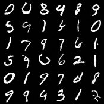
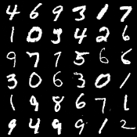
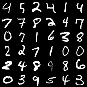

# Pytorch-DDPM-MNIST

This repository provides a straightforward implementation of DDPM for MNIST, intended for tutorial purposes. The implementation is based on the reference found at https://github.com/ermongroup/ddim .

To generate the plots, simply execute:

```
python train.py
```

The resulting plots can be found in the `./plot` directory.

## Samples

Samples after 10 epochs:



Samples after 100 epochs:



Samples after 1000 epochs:




